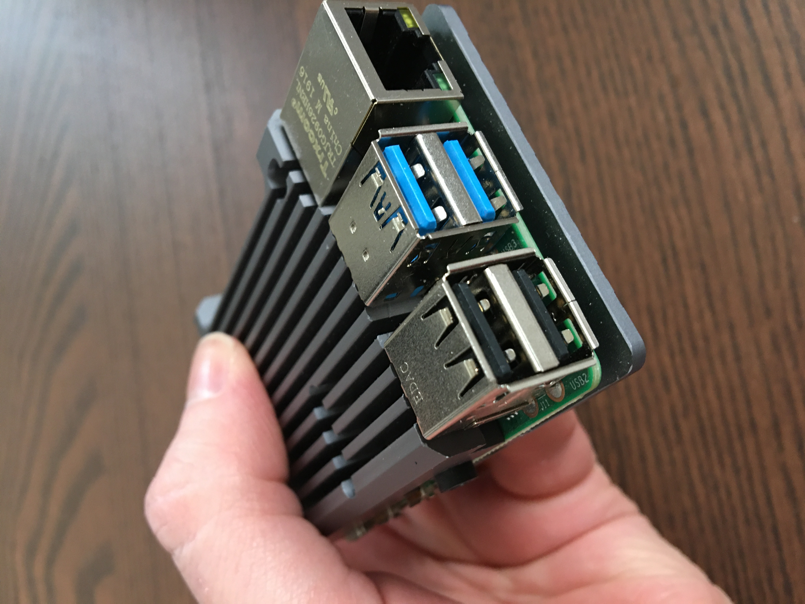
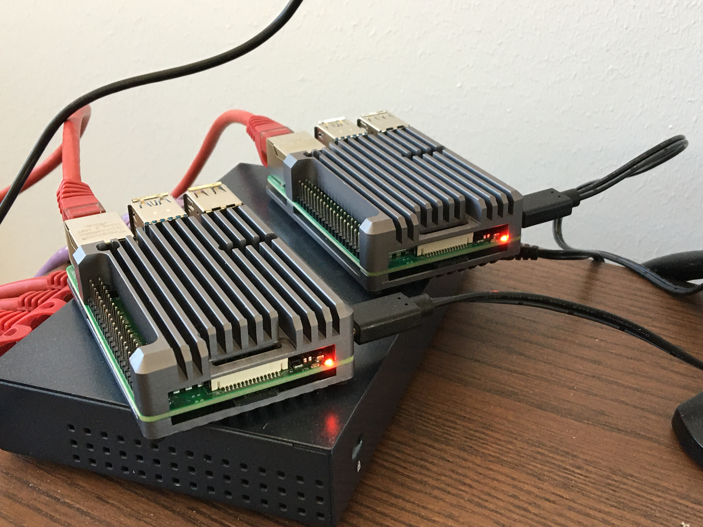

# Raspberry-Documentation
Official release date for the most basic installation instructions will be official here.
Scripts and automation will come at a later date, when its more mature.

Raspberry Pi 4 is a very capable little creditcard sized computer with a 4 Core ARM CPU. It comes with different boards, sizing 1GB, 2GB, 4GB and 8GB RAM. I have, for the most basic things in my test and online systems, always chosen the 4GB model and a 32GB SD card. Do not underestimate, these applications require both memory and CPU. Running it on Raspberry Pi 2, 3, 3B+, yes, it can be installed but will most likely fail or not perform well. Trust me, I've tried it already, I've been working on this for years.

It should also be said, most of these chapters will come with extensive explanations, why and why not to do things. You might be able to follow if you are an intermediate to advanced user familiar with linux bash and configuration.

### This will probably work on all Raspberry Pi 4 models.
* Chapter 0x00: Hardware and Requirements
* Chapter 0x01: Installing the raspberry SD card
* Chapter 0x02: Update the Debian Buster image file
* Chapter 0x03: Configuring IP addresses on eth0 and wlan0
* Chapter 0x04: Synchronizing the time with Network Time Servers
* Chapter 0x05: Installing and configuring components for RSyslog
* Chapter 0x06: Installing and configuring components for Wifi 802.11ac with WPA2-PSK
* Chapter 0x07: Installing and configuring components for DNS, DHCP, iptables
* Chapter 0x08: Installing and configuring components for IPSec, iptables
* Chapter 0x09: Configuring scheduled crontab NMAP scans of your wifi network
* Chapter 0x0A: Configuring and securing the SSH server access

### This will probably work on the 4GB and 8GB Raspberry Pi 4 models. (later release date)
* Chapter 0x0B: Hardware and Requirements
* Chapter 0x0C: Installing and configuring components for Docker (repo and installation)
* Chapter 0x0D: Installing and configuring components for Python3 environments.
* Chapter 0x0E: Installing and configuring pcap recorder (2021-05-01)
* Chapter 0x0F: Configuration of Python environment (2021-05-01)
* Chapter 0x10: Configuration of Python environment for plugins for wifi-triangulation (2021-06-01)
* More chapters in the pipe.

### Set the right expectations

NOTE:
Most of these components already exist and comes via the very well version managed Debian Buster repository. It should be somewhat safe to use, however I have had experiences of opensource software suddenly stopped working due to version handling and kernel differences. This may happen, and in such cases it might take time to get the problems fixed. If possible then dont update the firmware versions on your raspberry on your own, let them come with the repository updates.

1) **Myth** People have a tendency to misunderstand the use-case of wifi accesspoint signal range. The raspberry cannot produce long range wifi, and the businesscase is actually to stay within your house, and securely access the wifi. If you want a long range, you can buy a an external USB wifi adapter and use that as an accesspoint card. However, all wificards are not capable of being used as a Accesspoint. In some cases, your might even have to re-compile the sourcecode from the hostapd. I will, in my efforts try to produce or point to a compatible list of wifi adapters.

2) **Myth** People have a tendency to misunderstand the use-case of data throughput. Yes, you will ofcourse be able to watch 2 different netflix movies on two different mobilephones or update your mobilephones with updates. The Raspberry will make it possible, but there are ofcourse limitations. For example, I have made this work with 20/20Mhz band, and unfortunately been unsuccessful trying 40/40Mhz bands with the built-in wificard.

*Read carefully:*
I also publish this information because I care about your safety, I expect you to use this extensive knowledge **wisely** and **not** maliciously. If you find problems or detect security issues, don't hesitate to inform me. I expect you to do that.

*Read carefully:*
I strongly urge you to **not** put this device directly on the Internet, unless you know exactly what you are doing. I suggest atleast put it behind a NAT router, a firewall or atleast some kind of transit network.

# Chapters

### Chapter 0x00: Hardware and Requirements
in progress, and subject to change

* 1 Raspberry Pi 4, 4GB RAM or higher.
* 1 Raspberry Pi 4, power adapter with USB-C, 5V/3A.
* 1 GeekWorm Raspberry Pi 4 Armor heatsink.
* 2 SD Cards, 32GB.
* 1 USB 3.0 SD card reader.
* 1 Network Cable.
* 1 Network cable port, available on your switch, router, firewall or transit network.
* 1 USB 3.0 Memorystick, Kingston 64GB or higher. (used for logs and pcap)

Warning! This device will be warm. This device is going to be online most of the day, and carrying a heavy load, so a proper aluminium armor without fan is probably a good idea. Just make sure the heated components are properly attached and leading away the heat from the components. I have had success with the GeekWorm Raspberry Pi 4 Armor Gray, thus leading the cpu at +53C.




### Chapter 0x01: Installing the raspberry SD card
in progress, and the instruction is subject to change

**Instruction here on installing image from a Windows system**

in progress, and the instruction is subject to change

* [Instruction here].


**Instruction here on installing image from a Raspberry system**

I'm currently working on a Raspberry Pi with a Desktop, this is why the SD card instruction looks like this at the moment. Instructions for Windows will come in a while. But for now, I'm on a raspberry desktop.

I have based my Raspberry Pi wifi router image on the Raspbian Buster Lite version, but I'm pretty sure Raspberry Pi OS Buster version will work the same way as the previous versions. This will be tested extensively before the official release date 2020-07-01. At the time of this writing, this OS has not been tested.

* [Instruction here].

Download the **Raspberry Pi OS (32-bit) Lite** from **The Rasberry Pi foundation**, [here](https://www.raspberrypi.org/downloads/raspberry-pi-os/).

Open a console and prepare your image file to be written to the SD card.
```bash
$ sudo apt-get update
$ sudo apt-get install dcfldd gunzip dnsutils tcpdump nmap -y
```
Note: you can use the **dd** command, I just like the progress indicator of **dcfldd**.

Go to the Downloads folder
```bash
$ cd Downloads
$ ls -l
total 16469060
...
-rw-r--r-- 1 pi pi  452715448 jun 14 10:08  2020-05-27-raspios-buster-lite-armhf.zip
...
```

Verify the sha256 hash, like so, and verify the red text output in the console.
```bash
$ sha256sum 2020-05-27-raspios-buster-lite-armhf.zip | grep f5786604be4b41e292c5b3c711e2efa64b25a5b51869ea8313d58da0b46afc64
...
f5786604be4b41e292c5b3c711e2efa64b25a5b51869ea8313d58da0b46afc64  2020-05-27-raspios-buster-lite-armhf.zip
...
```

Extract the image with the gunzip command.
```bash
$ gunzip 2020-05-27-raspios-buster-lite-armhf.zip
```

Insert your USB 3.0 SD card reader, and run the following command.
```bash
$ dmesg
```
```bash
...
[18217.822017] usb 2-1: new SuperSpeed Gen 1 USB device number 2 using xhci_hcd
[18217.881582] usb 2-1: New USB device found, idVendor=0bda, idProduct=0326, bcdDevice=11.24
[18217.881598] usb 2-1: New USB device strings: Mfr=1, Product=2, SerialNumber=3
[18217.881611] usb 2-1: Product: USB3.0 Card Reader
[18217.881623] usb 2-1: Manufacturer: Realtek
[18217.881635] usb 2-1: SerialNumber: 201404081410
[18217.899942] usb-storage 2-1:1.0: USB Mass Storage device detected
[18217.901303] scsi host0: usb-storage 2-1:1.0
[18218.991413] scsi 0:0:0:0: Direct-Access     Generic- USB3.0 CRW   -SD 1.00 PQ: 0 ANSI: 6
[18219.003925] scsi 0:0:0:1: Direct-Access     Generic- USB3.0 CRW   -SD 1.00 PQ: 0 ANSI: 6
[18219.006767] sd 0:0:0:0: [sda] Attached SCSI removable disk
[18219.014432] sd 0:0:0:1: [sdb] Attached SCSI removable disk
[18219.022467] sd 0:0:0:0: Attached scsi generic sg0 type 0
[18219.022666] sd 0:0:0:1: Attached scsi generic sg1 type 0
...
[18380.662439] sd 0:0:0:1: [sdb] 62333952 512-byte logical blocks: (31.9 GB/29.7 GiB)
[18380.672670]  sdb: sdb1 sdb2
...
```
The last 2 lines contain a SD card and its partitions detected, in this case **sdb** (disk), **sdb1** (partition1) and **sdb2**  (partition2), because this is a raspberry card. Your output might be different, it might be **sda** or **sdb**.

To overwrite the SD card **sdb** with your new raspberry image. Please do note the warning, **This will indeed delete all previous contents of your SD card**, make sure its the correct card in your reader.
```bash
$ sudo dcfldd if=2020-05-27-raspios-buster-lite-armhf.img of=/dev/sdb bs=4M
```

* [Instruction here].


### Chapter 0x02: Update the Debian Buster image file
in progress

* Instruction on making a preconfigured Golden-Image here.


### Chapter 0x03: Configuring IP addresses on eth0 and wlan0
in prgress, also subject to change

In this section we will assign static IPv4 addresses on your raspbian. If you have other networks you should assign them to the configuration below, and use the correct network and subnetmask for your network. I will however be consistent here, most people with a little knowledge do understand that if you work with this system remotely, you will be disconnected and will need to reconnect to the device, while restarting the service.

* **Advice**: If you work with this device remotely, make sure you are entering the correct information, and that you are able to connect to it afterwards. Changeing the IP address may render the device unavailable, even the device is online.

```bash
$ sudo nano /etc/dhcpcd.conf
```
And add/modify the the eth0 static section:
```bash
    interface eth0
    static ip_address=192.168.220.30/24
    static routers=192.168.220.254
    static domain_name_servers=1.1.1.1 8.8.8.8
```
And add/modify the wlan0 static section:
```bash
    interface wlan0
    static ip_address=192.168.230.254/24
    # no routers
    # no domain_name_servers
```
Note: I will add IPv6 configuration later, and when I do, it will work perfectly with the raspbian networking.


### Chapter 0x04: Synchronizing the time with Network Time Servers
in progress, also subject to change

Since your raspberry doesnt have a physical clock, its important to have it synchronize its clock with the configured network time servers available. Like anyone working with Cyber security, correct timestamps is of the essence in any evidence or logs. This to determine the correct timestamp something happened. Failing to do so, will render logs and evidence unusable.

Ok, you don't really have to change the *timesynccd* service, because it comes preinstalled on Debian Buster, however it is a good idea to have knowledge about this service existance, and that you don't need to install the ntp service. The NTP service which in turn will open port UDP/123, opening a footprint for traffic towards your Raspberry. The ntp service is complicated to secure, so unless you know how, don't use it.

```bash
$ sudo nano /etc/systemd/timesyncd.conf
```
Example: I've made an example if you want to choose your own NTP servers.
```configuration
#  This file is part of systemd.
#
#  systemd is free software; you can redistribute it and/or modify it
#  under the terms of the GNU Lesser General Public License as published by
#  the Free Software Foundation; either version 2.1 of the License, or
#  (at your option) any later version.
#
# Entries in this file show the compile time defaults.
# You can change settings by editing this file.
# Defaults can be restored by simply deleting this file.
#
# See timesyncd.conf(5) for details.

[Time]
NTP=ntp3.sptime.se ntp4.sptime.se
#FallbackNTP=0.debian.pool.ntp.org 1.debian.pool.ntp.org 2.debian.pool.ntp.org 3.debian.pool.ntp.org
#RootDistanceMaxSec=5
PollIntervalMinSec=64
PollIntervalMaxSec=2048
```
* **Advice**: You can uncomment the *FallbackNTP* and *RootDistanceMaxSec* if you want to have a NTP fallback and make sure your NTP servers answer within 5 seconds. This is recommended.

* **Advice**: The *PollIntervalMinSec* and *PollIntervalMaxSec* is the interval frame between sending ntp requests to the destinations. A value below 64 seconds is *not* recommended, unless you wish to be *blacklisted* on the ntp providers. *So, don't go below 64 seconds*.


Example: Check if the time is synchronized.
```bash
$ timedatectl status
```
```bash

               Local time: sön 2020-06-14 10:44:44 UTC
           Universal time: sön 2020-06-14 10:44:44 UTC
                 RTC time: n/a
                Time zone: Etc/UTC (UTC, +0000)
System clock synchronized: yes
              NTP service: active
          RTC in local TZ: no
```

Example: Turning NTP on or off. Please do turn it on with *true*.
```bash
$ sudo timedatectl set-ntp false
$ sudo timedatectl set-ntp true
```

Example: List available timezones. Grep if you want a shorter list.
```bash
$ timedatectl list-timezones
$ timedatectl list-timezones | grep America
$ timedatectl list-timezones | grep Europe
$ timedatectl list-timezones | grep Australia/Sydney
```

Example: Set timezone.
```bash
$ sudo timedatectl set-timezone Europe/Paris
$ sudo timedatectl set-timezone Europe/Stockholm
$ sudo timedatectl set-timezone Australia/Sydney
```
Example: Check the status the **systemd-timesyncd** service.
```bash
$ systemctl status systemd-timesyncd
```
Example: Restart the **systemd-timesyncd** service.
```bash
$ systemctl restart systemd-timesyncd
```
Thankyou for reading this section, this will help you in our later sections during logging, evidence and negotiating ipsec and prevent you from getting errors later when we use transport layer security with certificates. They will depend on you completing this section.


### Chapter 0x05: Installing and configuring components for RSyslog
in progress


### Chapter 0x06: Installing and configuring components for Wifi 802.11ac with WPA2-PSK
in progress, also subject to change

In this chapter we are going to install the hostapd, an essential component for making your Raspberry Pi 4 a wifi access point. 

* **Advice** This step will only enable the hostapd and make it start broadcasting its ssid name.
* **Advice** Chapter 0x07, 0x08 are required to make the access point work.
* **Advice** You will need to disable the wpa_supplicant.service

If you are using your Raspberry Pi 4, wifi to connect to another accesspoint, now is the time to stop doing that.

Update and upgrade your OS, then install the Wifi AccessPoint daemon.
```bash
$ sudo apt-get update
$ sudo apt-get upgrade
$ sudo apt-get install hostapd -y
```

Make sure the hostapd.service is stopped.
```bash
$ sudo systemctl stop hostapd
```

Start by disabling the wpa_supplicant.service, which makes your raspberry a client to an external access point. From now on your raspberry is going to be the access point.
```bash
$ sudo systemclt stop wpa_supplicant.service
$ sudo systemctl disable wpa_supplicant.service
```

And if you really want to be sure its not used, then..
```bash
$ sudo mv /etc/wpa_supplicant/wpa_supplicant.conf /etc/wpa_supplicant/wpa_supplicant.conf.old
```


Make sure your *hostapd.conf* is pointed out inside the file */etc/default/hostapd*.
```bash
$ sudo nano /etc/default/hostapd
```
```bash
    # Defaults for hostapd initscript
    #
    # WARNING: The DAEMON_CONF setting has been deprecated and will be removed
    #          in future package releases.
    #
    # See /usr/share/doc/hostapd/README.Debian for information about alternative
    # methods of managing hostapd.
    #
    # Uncomment and set DAEMON_CONF to the absolute path of a hostapd configuration
    # file and hostapd will be started during system boot. An example configuration 
    # file can be found at /usr/share/doc/hostapd/examples/hostapd.conf.gz
    #
    #DAEMON_CONF=""

    # Additional daemon options to be appended to hostapd command:-
    #       -d   show more debug messages (-dd for even more)
    #       -K   include key data in debug messages
    #       -t   include timestamps in some debug messages
    #
    # Note that -B (daemon mode) and -P (pidfile) options are automatically
    # configured by the init.d script and must not be added to DAEMON_OPTS.
    #
    #DAEMON_OPTS=""

    # yes, enter it here.. even its deprecated.
    DAEMON_CONF="/etc/hostapd/hostapd.conf"

```

I have made a couple of hostapd configuration examples for you to select from. 
* **Advice** Please select the one that is most appropriate for you.
* **Advice** Read up on your documentation for your devices before selecting the one to choose.

```bash
$ sudo nano /etc/hostapd/hostapd.conf
```

Example configuration 1: Wireless 802.11ac on 5Ghz, on channel 48, bandwidth 20/20Mhz. Recommended for iPhone 6 and upwards.
```bash

    ########################################
    ## This configuration will work with  ## 
    ## newer iPhone models, 6s and newer  ##
    ## Android phones.                    ##
    ##                                    ##
    ## However Smart TV's might not work  ##
    ## with this as some of them still    ##
    ## use 802.11b/g/n on the 2.4Ghz      ##
    ## band.                              ##
    ##                                    ##
    ## Check your documentation.          ##
    ##                                    ##
    ## This configuration is recommended  ##
    ## for devices that have VPN          ##
    ## capability.                        ##
    ##                                    ##
    ## Check your documentation.          ##
    ########################################
    
    # attach this hostapd to wlan0 (builtin wireless card)
    interface=wlan0
    
    # always use the nl80211 driver, unless otherwise specified.
    driver=nl80211
    
    # enable the 5Ghz band.
    hw_mode=a
    
    # Channel 36 or 48 is probably your best option for 20/20Mhz band.
    # Important, if you run multiple Raspberries as accesspoints next to eachother, I urge you to use different channels.
    channel=48
    
    # Country Wireless compliance code. (enter your country code: Example GB, US or SE)
    country_code=SE
    
    # Wireless compliance 802.11d (1=enable, 0=disable)
    ieee80211d=1
    
    # Wireless compliance 802.11n (1=enable, 0=disable)
    ieee80211n=1
    
    # Wireless compliance 802.11ac (1=enable, 0=disable)
    ieee80211ac=1
    
    # new variable, untested.
    #wme_enabled=1
    
    # bandwith controller.
    wmm_enabled=1

    # bandwith controller. 40/40Ghz example. Does not work.
    # ht_capab=[HT40+][SHORT-GI-80][DSSS_CCK-40]

    # macaddress acl (1=enabled, 0=disabled)
    macaddr_acl=0

    # hide ssid broadcasts (1=enabled, 0=disabled)
    ignore_broadcast_ssid=0
    
    ########################################
    ## Wifi settings here                 ##
    ########################################

    # enter ssid name here, make sure it does not conflict with another accesspoint.
    ssid=wifi-03.firestorm.org
    
    # enable authentication (1=enable, 0=disable)
    auth_algs=1
    
    # enforce wpa2 algorithms. 1=wpa1, 2=wpa2, 3=combined wpa1 and wpa2 (not recommended)
    wpa=2
    
    # enforce use of pre-shared key.
    wpa_key_mgmt=WPA-PSK
    
    # enforce the CCMP encryption algorithm
    rsn_pairwise=CCMP
    
    # enforce hostapd with your preshared key.
    wpa_passphrase=<enter your password here. 20-32 characters recommended.>
    
```


Enable traffic forwarding from your wlan0 card to eth0 physical network card.
```bash
$ sudo nano /etc/sysctl.conf
```


Example: Find *net.ipv4.ip_forward* inside your *sysctl.conf* and set it to *1*.
```bash
    net.ipv4.ip_forward=1
```


The hostapd is masked, which means you cannot enable it per default. Unmask it and then enable it.
```bash
$ sudo systemctl unmask hostapd
$ sudo systemctl enable hostapd
```

Example: Check status of the hostapd.service
```bash
$ sudo systemctl status hostapd.service
```

Example: Start the hostapd.service
```bash
$ sudo systemctl start hostapd.service
```

Example: Stop the hostapd.service
```bash
$ sudo systemctl stop hostapd.service
```


### Chapter 0x07: Installing and configuring components for DNS, DHCP, iptables
in progress, subject to change

In this chapter we are going to enable dhcp and dns which will enable your accesspoint to configure your wifi attached devices with the ip addresses they will be using to navigate the wifi network. I'll be using dnsmasq since this probably is the most qualified software for this task. Dnsmasq is widely used in routers and appliances for both dhcp and dns navigation. If you shoud select something, then select dnsmasq. In a few moments you'll understand why.

I'm repeating the installation of dnsutils, tcpdump, nmap, because you will need them later in this chapter.

update, upgrade and install dnsmasq
```bash
$ sudo apt-get update
$ sudo apt-get upgrade
$ sudo apt-get install dnsmasq dnsutils tcpdump nmap -y
```
```bash
$ sudo systemctl stop dnsmasq
$ sudo systemctl stop hostapd
```

Rename the dnsmasq.conf to old and start a new dnsmasq.conf file.
```bash
$ sudo mv /etc/dnsmasq.conf /etc/dnsmasq.conf.orig
```
```bash
$ sudo nano /etc/dnsmasq.conf
```

Add the following entries.
```bash
    local=/localnet/

    # exmple on howto re-route ntp dns requests to another network time protocol server.
    #address=/ntp.org/193.11.166.2
    #address=/time-ios.apple.com/193.11.166.2

    addn-hosts=/etc/dnsmasq/hostile_hosts

    # exmpand-hosts adds the appropriate domain specified below to your devices
    # when retreiving dhcp addresses from dnsmasq.
    
    expand-hosts
    domain=internal.firestorm.org
    domain=wifi.firestorm.org,192.168.230.0/24
    # we havent added docker yet, but this entry would be correct.
    #domain=docker.firestorm.org,172.17.0.0/16

    # listen for DNS request on these addresses.
    listen-address=192.168.230.254
    listen-address=192.168.220.30
    # we havent added docker yet, but this entry would be correct.
    #listen-address=172.17.0.1
    listen-address=127.0.0.1

    # no dhcp responses on eth0
    no-dhcp-interface=eth0
    # we havent added docker yet, but this entry would be correct.
    #no-dhcp-interface=docker0

    # dhcp wifi network
    dhcp-range=192.168.230.10,192.168.230.30,255.255.255.0,6h
    dhcp-option=option:ntp-server,193.11.166.2,193.11.166.18
    dhcp-option=option:dns-server,192.168.230.254
    dhcp-option=option:domain-search,wifi.firestorm.org
    # make wpad behave on wifi.
    dhcp-option=252,"\n"
    # authorative dhcp on wifi network.
    dhcp-authoritative
    
    # example, you can add your own command to run when a client requests a dhcp entry.
    dhcp-script=/bin/echo

    srv-host=_ipp._tcp,printer.internal.firestorm.org,631
    srv-host=_raw._tcp,printer.internal.firestorm.org,9100
    txt-record=_http._tcp.printer.internal.firestorm.org,name=value,paper=A4

    log-queries
    log-dhcp

    conf-dir=/etc/dnsmasq.d/,*.conf

```

```bash
$ sudo mkdir /etc/dnsmasq/
$ sudo nano /etc/dnsmasq/hostile_hosts
```

```bash
    ########################################
    ## HOSTILE                            ##
    ########################################

    # redirector examples
    # redirect url of choice to ip of choice
    127.0.0.1   *.hostile-web-server.com

```

Add static dns records for your dnsmasq installation.
```bash
$ sudo nano /etc/hosts
```

```bash
    # leave this section unchanged.
    127.0.0.1       localhost
    ::1             localhost ip6-localhost ip6-loopback
    ff02::1         ip6-allnodes
    ff02::2         ip6-allrouters

    # example: 127.0.1.1 should refer to your specific raspberry pi hostname.
    # in my case, my raspberry name is firestorm-cataclystic-0003.
    127.0.1.1       firestorm-cataclystic-0003
    
    # ip address, see /etc/dhcpcd.conf for wifi network card configuration.
    192.168.230.254 firestorm-cataclystic-0003.wifi.firestorm.org
   
    # ip address, see /etc/dhcpcd.conf for physical network card configuration.
    192.168.220.30  firestorm-cataclystic-0003.internal.firestorm.org
    
    # we havent added docker yet, but this entry would be correct.
    #172.17.0.1      gate.docker.firestorm.org

```

##### Making a temporary network address translation (NAT) on your raspberry
One of the more important things left to do now, is to separate the wifi-network (wlan0 192.168.230.0/24) from the transit-network (eth0 192.168.220.0/24). Since this is 2 different subnets we neet to add a network address translation, in network terms referred to as NAT.

This would normally be done by adding a **post routing masquerade** on Linux, yes its still a NAT on the eth0 interface, since this is going to route the wifi traffic out towards the Internet and set the routing tables correctly for packet forwarding between wlan0 and eth0, the best thing to do is to add this on eth0.

Add the following statement on your raspberry to start network address translation
```bash
$ sudo iptables -A POSTROUTING -o eth0 -j MASQUERADE
```
IMPORTANT; Do note that the above statement is in no way permanent, if you turn the raspberry off or restart it, you will need to add this statement again.

##### Making a permanent network address translation (NAT) on your raspberry
Networking and iptables on Linux is difficult subject for people who are not familiar with network configurations. In other words this section could work for you, or it could bring you a lot of headache. I'll try to make this as simple and easy as possible and in each chapter from here, add more detail.

* Step 1: Add a iptables configuration file on disk
* Step 2: Add the permanent statements to the configuration file
* Step 3: Add the raspberry load the iptables configuration at startup
* Step 4: Restart the Raspberry Pi and log back in again
* Step 5: Verify the ip tables configuration

Step 1: Add a iptables configuration file on disk

Step 1.1: Create the configuration file
```bash
$ sudo touch /etc/iptables.ipv4.nat
```

Step 1.2: Add ownership to user root and group root
```bash
$ sudo chown root:root /etc/iptables.ipv4.nat
```

Step 1.3: Set the access rights for root read/write, group read and everyone read
```bash
$ sudo chmod 644 /etc/iptables.ipv4.nat
```

Step 2: Add the permanent statements to the configuration file
```bash
$ sudo nano /etc/iptables.ipv4.nat
```
```bash
    *nat
    :PREROUTING ACCEPT [0:0]
    :INPUT ACCEPT [0:0]
    :POSTROUTING ACCEPT [0:0]
    :OUTPUT ACCEPT [0:0]
    
    # Add a NAT to outbound traffic on the eth0 interface.
    # This statement is typically what we would write in our 'iptables -A POSTROUTING -o eth0 -j MASQUERADE' statement.
    -A POSTROUTING -o eth0 -j MASQUERADE
    
    # Add a NAT to outbound traffic on the wlan0 interface.
    # We will talk more about this in the IPSec chapter, but for now comment it out.
    # This statement is typically what we would write in our 'iptables -A POSTROUTING -o wlan0 -j MASQUERADE' statement.
    #-A POSTROUTING -o wlan0 -j MASQUERADE
    
    # Below command commits the nat statements
    COMMIT

    *filter
    :INPUT ACCEPT [0:0]
    :FORWARD ACCEPT [0:0]
    :OUTPUT ACCEPT [0:0]
    :LOG_ACCEPT - [0:0]
    :LOG_DROP - [0:0]

    # I have added these statements for future debugging and logging, leave them as is.
    -A LOG_ACCEPT -j LOG --log-prefix "INPUT:ACCEPT " --log-level 6
    -A LOG_ACCEPT -j ACCEPT
    -A LOG_DROP   -j LOG --log-prefix "INPUT:DROP " --log-level 6
    -A LOG_DROP   -j DROP
    
    # Below command commits the filter and access list statements
    COMMIT
```
WARNING; This iptables configuration is permissive to just get you started, please do not connect any of the physical interfaces with this configuration to any unsecured network, such as Internet. This would be a very bad idea. We will touch this subject further, and secure the iptables rules in the upcomming chapters.

* ACCEPT - will allow all traffic.
* DROP - will drop packages without sending a tcp reset. 


Step 3: Add the raspberry load the iptables configuration at startup
```bash
$ sudo nano /etc/rc.local
```
```bash

    # Add the iptables-restore statement here to load the 
    # iptables.ipv4.nat configuration, just before the 
    # exit 0 statement. 
    iptables-restore < /etc/iptables.ipv4.nat

    exit 0
```

Step 4: Restart the Raspberry Pi and log back in again
```bash
$ sudo restart
```

Step 5: Verify the ip tables configuration
```bash
$ sudo iptables -L -v -n
```


#### Troubleshooting


#### Summary
The chapters until here has taken you all the way to get your Raspberry Pi up and running as a simple wifi accesspoint. We have added the dnsmasq configuration, with both dns-, dhcp-, hostnames- and some basic iptables configuration. As I wrote, iptables are somewhat complex for beginners, I promise we will be touching the iptables configuration in further chapters. From this point we will be securing the configurations.




### Chapter 0x08: Installing and configuring components for IPSec, iptables
in progress, subject to change

Install the StrongSwan IPSec packages.
```bash
$ sudo apt-get install strongswan -y
```

Example 1: Configure the default IPSec settings with preshared-key
```bash
$ sudo nano /etc/ipsec.conf
```

```bash
    # ipsec.conf - strongSwan IPsec configuration file

    # basic configuration

    config setup
        # strictcrlpolicy=yes
        # uniqueids = no

    conn %default

        # lifetime
        lifetime=12h
        dpddelay=30s
        dpdtimeout=120s
        dpdaction=restart

        ikelifetime=60m
        keylife=20m
        rekeymargin=3m
        keyingtries=1
        keyexchange=ikev2
        mobike=yes
        authby=secret
        reauth=no

    conn vpnserver-dhcpclients

        # self config
        left=192.168.230.254
        leftid=wifi-03@wifi.firestorm.org
        leftsubnet=0.0.0.0/0
        leftfirewall=yes

        # clients config
        # any client can start negotiating.
        right=%any
        # all clients need to present themselfs as something@wifi.firestorm.org
        rightid=*@wifi.firestorm.org
        # when ipsec connected, use this ipv4 pool inside the raspberry.
        rightsourceip=192.168.231.0/24
        # when ipsec connected, use this dns server
        rightdns=192.168.230.254
        #rightdns=172.17.0.1
        rightupdown=/bin/echo
        auto=add

    include /var/lib/strongswan/ipsec.conf.inc
```

Example 1: Add your IPSec device for preshared-key tunnel on the wifi-network.
```bash
$ sudo nano /etc/ipsec.secrets
```

```bash
    # This file holds shared secrets or RSA private keys for authentication.

    # RSA private key for this host, authenticating it to any other host
    # which knows the public part.

    # EXAMPLE: yourdevice
    yourdevice@wifi.firestorm.org : PSK YourSuperLongPasswordHere
```
To prevent future problems with implicit deny iptables, which we will enable later, here are some things to prepare.

IMPORTANT; The above configured ipsec configuration will work flawlessly with iptables when installing strongswan on a vanilla raspberry-kernel; however it will definately stop working when updating the raspberry kernel to new versions. Obviously there is some compiled or hardwired relation between the strongswan version and the iptables netlink kernel driver.

To make this work, also with an updated kernel, you will need to enable the charon kernel-netlink and socket-default traffic selectors.

* Step 1: Enable the charon socket-default fwmark and load the socket selector.
* Step 2: Enable the charon kernel-netlink negated fwmark and load the netlink selector.
* Step 3: Enable the charon ipsec peer traffic selector for iptables selector rules to be created when negotiating ipsec.

Lets get started

Step 1: Enable the charon socket-default fwmark and load the socket selector.
```bash
$ sudo nano /etc/strongswan.d/charon/socket-default.conf
```
```bash
socket-default {

    # Firewall mark to set on outbound packets.
    fwmark = 0x4

    # Whether to load the plugin. Can also be an integer to increase the
    # priority of this plugin.
    load = yes

    # Set source address on outbound packets, if possible.
    # set_source = yes

    # Force sending interface on outbound packets, if possible.
    # set_sourceif = no

    # Listen on IPv4, if possible.
    # use_ipv4 = yes

    # Listen on IPv6, if possible.
    # use_ipv6 = yes

}
```


Step 2: Enable the charon kernel-netlink negated fwmark and load the netlink selector.
```bash
$ sudo nano /etc/strongswan.d/charon/kernel-netlink.conf
```
```bash
kernel-netlink {

    # Buffer size for received Netlink messages.
    # buflen = <min(PAGE_SIZE, 8192)>

    # Force maximum Netlink receive buffer on Netlink socket.
    # force_receive_buffer_size = no

    # Firewall mark to set on the routing rule that directs traffic to our
    # routing table.
    fwmark = !0x4

    # Whether to ignore errors potentially resulting from a retransmission.
    # ignore_retransmit_errors = no

    # Whether to load the plugin. Can also be an integer to increase the
    # priority of this plugin.
    load = yes

    # MSS to set on installed routes, 0 to disable.
    # mss = 0

    # MTU to set on installed routes, 0 to disable.
    # mtu = 0

    # Whether to perform concurrent Netlink ROUTE queries on a single socket.
    # parallel_route = no

    # Whether to perform concurrent Netlink XFRM queries on a single socket.
    # parallel_xfrm = no

    # Whether to always use XFRM_MSG_UPDPOLICY to install policies.
    # policy_update = no

    # Whether to use port or socket based IKE XFRM bypass policies.
    # port_bypass = no

    # Whether to process changes in routing rules to trigger roam events.
    # process_rules = no

    # Maximum Netlink socket receive buffer in bytes.
    # receive_buffer_size = 0

    # Number of Netlink message retransmissions to send on timeout.
    # retries = 0

    # Whether to trigger roam events when interfaces, addresses or routes
    # change.
    # roam_events = yes

    # Whether to set protocol and ports in the selector installed on transport
    # mode IPsec SAs in the kernel.
    # set_proto_port_transport_sa = no

    # Netlink message retransmission timeout, 0 to disable retransmissions.
    # timeout = 0

    # Lifetime of XFRM acquire state and allocated SPIs in kernel.
    # xfrm_acq_expires = 165

    # XFRM policy hashing threshold configuration for IPv4 and IPv6.
    spdh_thresh {

        ipv4 {

            # Local subnet XFRM policy hashing threshold for IPv4.
            # lbits = 32

            # Remote subnet XFRM policy hashing threshold for IPv4.
            # rbits = 32

        }

        ipv6 {

            # Local subnet XFRM policy hashing threshold for IPv6.
            # lbits = 128

            # Remote subnet XFRM policy hashing threshold for IPv6.
            # rbits = 128

        }

    }

}
```

Step 3: Enable the charon ipsec peer traffic selector for iptables selector rules to be created when negotiating ipsec.
```bash
$ sudo nano /etc/strongswan.d/charon/kernel-libipsec.conf
```
```bash
kernel-libipsec {
  # allow peer traffic selector
  allow_peer_ts = yes
}
```


Here are some commands to disable, enable, start, stop the ipsec.service

Disable the ipsec.service
```bash
$ sudo systemctl disable ipsec.service
```

Enable the ipsec.service
```bash
$ sudo systemctl enable ipsec.service
```

Stop the ipsec.service
```bash
$ sudo systemctl stop ipsec.service
```

Start the ipsec.service
```bash
$ sudo systemctl start ipsec.service
```

Get the status of the ipsec.service
```bash
$ sudo systemctl status ipsec.service
```

Get the status of the ipsec connections made so far

```bash
$ sudo ipsec statusall
```
```bash
    Status of IKE charon daemon (strongSwan x.x.x, Linux 5.x.x-v7l+, armv7l):
      uptime: 13 days, since Mar 19 19:05:06 2021
      malloc: sbrk 2760704, mmap 0, used 907056, free 1853648
      worker threads: 11 of 16 idle, 5/0/0/0 working, job queue: 0/0/0/0, scheduled: 3
      loaded plugins: charon aes rc2 sha2 sha1 md5 mgf1 random nonce x509 revocation constraints pubkey pkcs1 pkcs7 pkcs8 pkcs12 pgp dnskey sshkey pem openssl fips-prf gmp agent xcbc hmac gcm attr kernel-netlink resolve socket-default connmark stroke updown counters
    Virtual IP pools (size/online/offline):
      192.168.231.0/24: 254/1/1
    Listening IP addresses:
      192.168.220.30
      192.168.230.254
    Connections:
    vpnserver-dhcpclients:  192.168.230.254...%any  IKEv2, dpddelay=30s
    vpnserver-dhcpclients:   local:  [wifi-03@wifi.firestorm.org] uses pre-shared key authentication
    vpnserver-dhcpclients:   remote: [*@wifi.firestorm.org] uses pre-shared key authentication
    vpnserver-dhcpclients:   child:  0.0.0.0/0 === dynamic TUNNEL, dpdaction=restart
    Security Associations (1 up, 0 connecting):
    vpnserver-dhcpclients[402]: ESTABLISHED 24 minutes ago, 192.168.230.254[wifi-03@wifi.firestorm.org]...192.168.230.15[JM-6s-Plus@wifi.firestorm.org]
    vpnserver-dhcpclients[402]: IKEv2 SPIs: e37ebeff3870b2c6_i f76ce6da4ebbcdf9_r*, rekeying in 30 minutes
    vpnserver-dhcpclients[402]: IKE proposal: AES_CBC_256/HMAC_SHA2_256_128/PRF_HMAC_SHA2_256/MODP_2048
    vpnserver-dhcpclients{1923}:  INSTALLED, TUNNEL, reqid 41, ESP SPIs: c693110e_i 08f45c7a_o
    vpnserver-dhcpclients{1923}:  AES_CBC_256/HMAC_SHA2_256_128, 12652 bytes_i (81 pkts, 52s ago), 26505 bytes_o (69 pkts, 52s ago), rekeying in 11 hours
    vpnserver-dhcpclients{1923}:   0.0.0.0/0 === 192.168.231.1/32
```


### Chapter 0x09: Configuring scheduled crontab NMAP scans of your wifi network
in progress, and subject to change

Now that we have functional accesspoints and are hopefully using them for our devices, such as phones etc, I will take the opportunity to get you started on automated network scanning. This to find the simplest form of vulnerabilities on your networks. This section is for somewhat advanced users, but I will try to keep it simple.

There are 2 questions we need to solve before we get started.
* First: Why would we want to automate scans on our wifi networks?
* Second: Setting the correct expectations?

##### First: Why would we want to automate scans on our wifi networks?
* To detect devices attached to our network. Our devices and potential rouge devices.
* To detect devices attached to our network. Detect the obvious security holes.
* What you don't know you cannot defend against. If you don't look, you'll never find out.

##### Second: Setting the correct expectations?
NMAP is in first case an enumeration tool, to map networks. The plugins used by NMAP are small skripts to attempt to identify the simplest and probably the worst kind of vulnerabilities. NMAP is not full scale a vulnerability scanner, but a network mapper - to detect whatever it is you have connected to your network.

In this section we will
* Add a USB 3.0 Kingston 64GB storage volume for NMAP data and for future storage of PCAP data on your Raspberry Pi 4 wifi accesspoint.
* Add auto-mount configuration for the 64 GB volume.
* Add crontab scheduled NMAP plugin downloads.
* Add crontab scheduled NMAP scans and write those to the Kingston 64GB volume.

Lets get started

Step 1: Start by inserting the Kingston 64GB in the blue usb 3.0 ports on your Raspberry Pi wifi accesspoint.
Step 2: Logon with SSH or console, on your accesspoint.


### Chapter 0x0A: Configuring and securing the SSH server access
in progress


### Chapter 0x0B: Hardware and Requirements
in progress


### Chapter 0x0C: Installing and configuring components for Docker (repo and installation)
in progress


### Chapter 0x0D: Installing and configuring components for Python3 environments (2021-05-01)
in progress


### Chapter 0x0E: Installing and configuring pcap recorder (2021-05-01)
in progress


### Chapter 0x0F: Configuration of Python environment (2021-05-01)
in progress


### Chapter 0x10: Configuration of Python environment for plugins for wifi-triangulation (2021-06-01)
in progress

