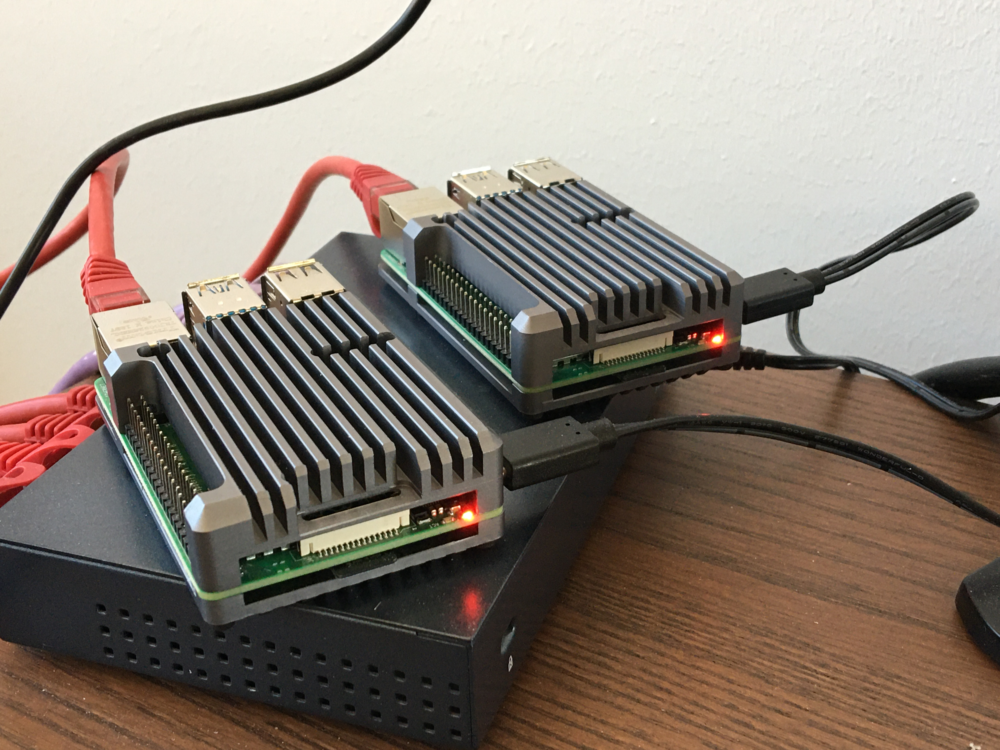

# Raspberry-Documentation
Raspberry Pi 4 is a very capable little creditcard sized computer with a 4 Core ARM CPU. It comes with different boards, sizing 1GB, 2GB, 4GB and 8GB RAM. I have, for the most basic things in my test and online systems, always chosen the 4GB model and a 32GB SD card. Do not underestimate, these applications require both memory and CPU. Running it on Raspberry Pi 2, 3, 3B+, yes, it can be installed but will most likely fail or not perform well. Trust me, I've tried it already, I've been working on this for years.

It should also be said, most of these chapters will come with extensive explanations, why and why not to do things. You might be able to follow if you are an intermediate to advanced user familiar with linux bash and configuration.

### This will probably work on all Raspberry Pi 4 models.
* Chapter 0x00: Hardware and Requirements
* Chapter 0x01: Installing the raspberry SD card
* Chapter 0x02: Update the Ubuntu 22.04.3 image file
* Chapter 0x03: Configuring IP addresses on eth0 and wlan0
* Chapter 0x04: Synchronizing the time with Network Time Servers
* Chapter 0x05: Installing and configuring components for RSyslog
* Chapter 0x06: Installing and configuring components for Wifi 802.11ac with WPA2-PSK
* Chapter 0x07: Installing and configuring components for DNS, DHCP, iptables
* Chapter 0x08: Installing and configuring components for IPSec, iptables
* Chapter 0x09: Configuring scheduled crontab NMAP scans of your wifi network
* Chapter 0x0A: Configuring and securing the SSH server access

### This will probably work on the 4GB and 8GB Raspberry Pi 4 models. (later release date)
* Chapter 0x0B: Hardware and Requirements
* Chapter 0x0C: Installing and configuring components for Docker (repo and installation)
* Chapter 0x0D: Installing and configuring components for Python3 environments.
* Chapter 0x0E: Installing and configuring pcap recorder
* Chapter 0x0F: Configuration of Python environment
* Chapter 0x10: Configuration of Python environment for plugins for wifi-triangulation
* More chapters in the pipe.

### Set the right expectations

NOTE:
Most of these components already exist and comes via the very well version managed Debian Buster repository. It should be somewhat safe to use, however I have had experiences of opensource software suddenly stopped working due to version handling and kernel differences. This may happen, and in such cases it might take time to get the problems fixed. If possible then dont update the firmware versions on your raspberry on your own, let them come with the repository updates.

1) **Myth** People have a tendency to misunderstand the use-case of wifi accesspoint signal range. The raspberry cannot produce long range wifi, and the businesscase is actually to stay within your house, and securely access the wifi. If you want a long range, you can buy a an external USB wifi adapter and use that as an accesspoint card. However, all wificards are not capable of being used as a Accesspoint. In some cases, your might even have to re-compile the sourcecode from the hostapd. I will, in my efforts try to produce or point to a compatible list of wifi adapters.

2) **Myth** People have a tendency to misunderstand the use-case of data throughput. Yes, you will ofcourse be able to watch 2 different netflix movies on two different mobilephones or update your mobilephones with updates. The Raspberry will make it possible, but there are ofcourse limitations. For example, I have made this work with 20/20Mhz band, and unfortunately been unsuccessful trying 40/40Mhz bands with the built-in wificard.

*Read carefully:*
I also publish this information because I care about your safety, I expect you to use this extensive knowledge **wisely** and **not** maliciously. If you find problems or detect security issues, don't hesitate to inform me. I expect you to do that.

*Read carefully:*
I strongly urge you to **not** put this device directly on the Internet, unless you know exactly what you are doing. I suggest atleast put it behind a NAT router, a firewall or atleast some kind of transit network.

# Chapters

### Chapter 0x00: Hardware and Requirements
in progress, and subject to change

* 1 Raspberry Pi 4, 4GB RAM or higher.
* 1 Raspberry Pi 4, power adapter with USB-C, 5V/3A.
* 1 GeekWorm Raspberry Pi 4 Armor heatsink.
* 2 SD Cards, 32GB.
* 1 USB 3.0 SD card reader.
* 1 Network Cable.
* 1 Network cable port, available on your switch, router, firewall or transit network.
* 1 USB 3.0 Memorystick, Kingston 64GB or higher. (used for logs and pcaps)
* 1 D-Link DWM-222 4G dongle + SIM card, for 4G wan connection.

Warning! This device will be warm. This device is going to be online most of the day, and carrying a heavy load, so a proper aluminium armor without fan is probably a good idea. Just make sure the heated components are properly attached and leading away the heat from the components. I have had success with the GeekWorm Raspberry Pi 4 Armor Gray, thus leading the cpu at +53C.

### Chapter 0x01: Installing the raspberry ubuntu SD card
Downloading the Ubuntu Server 22.04.3 for Raspberry Pi. Follow the links [here](https://ubuntu.com/download/raspberry-pi)

* Installing image to card from a Windows system [here]()
* Installing image to card from a Raspberry system [here]()

### Chapter 0x02: Update the Ubuntu 22.04.3 image file
Always update the Ubuntu 22.04.3 image with the latest updates. There is always new updates available, so make this a best practise

```bash
$ sudo apt update
$ sudo apt full-upgrade -y
```


### Chapter 0x03: Configuring IP addresses on eth0 and wlan0
In this section we will assign static IPv4 and IPv6 addresses on your ubuntu 22.04. If you have other networks you should assign them to the configuration below, and use the correct network and subnetmask for your network. Remember to be consistent with your subnetmasks and ip subnet if you do.

* **Advice**: If you work remotely via SSH, make sure you are entering the correct information, and that you are able to re-connect to it afterwards. Changeing the IP address may render the device unavailable, even the device is online.

Create a netplan configuration
```bash
$ sudo nano /etc/netplan/10-router.yaml
```

And add/modify the the fixed interfaces static IPv4 and IPv6 sections:
```bash
network:

    version: 2

    ethernets:
        eth0:
            renderer: networkd
            addresses: [ 192.168.220.1/24, fe80::1/64, fc00:220::1/64 ]
            link-local: [ ]
            accept-ra: false
            dhcp4: false
            dhcp6: false
            optional: true

            ## this section will be commented, when we add the 4G modem.
            routes:
                - to: 0.0.0.0/0
                  via: 192.168.220.254
                  on-link: false

            nameservers:
                search: [ "firestorm.org", "reserved-ipv4.firestorm.org", "reserved-ipv6.firestorm.org" ]
                addresses: [ 192.168.220.1, fc00:220::1 ]

        wlan0:
            renderer: networkd
            addresses: [ 192.168.230.1/24, fe80::1/64, fc00:230::1/64 ]
            link-local: [ ]
            accept-ra: false
            dhcp4: false
            dhcp6: false
            optional: true

            nameservers:
                search: [ "firestorm.org", "wireless-ipv4.firestorm.org", "wireless-ipv6.firestorm.org" ]
                addresses: [ 192.168.230.1, fc00:230::1 ]

	## we will add a ipsec0 interface in the following sections, then we will uncomment these.
        #ipsec0:
        #    renderer: networkd
        #    addresses: [ 192.168.231.1/24, fe80::1/64, fc00:231::1/64 ]
        #    link-local: [ ]
        #    accept-ra: false
        #    dhcp4: false
        #    dhcp6: false
        #    optional: true

        #    nameservers:
        #        search: [ "firestorm.org", "ipsec-v4.firestorm.org", "ipsec-ipv6.firestorm.org" ]
        #        addresses: [ 192.168.231.1, fc00:231::1 ]

    ## This section is for a 4G modem, I will add this in a comming section, then we will uncomment these.
    #modems:
    #    cdc-wdm:
    #        renderer: NetworkManager
    #        apn: internet.tele2.se
    #        #auto-config: true
    #        #pin: 0000
    #        dhcp4: true
    #        dhcp6: true
    #        #username: 
    #        #password: 
    #        match:
    #            name: cdc-wdm*

```

To try out the configuration for 120 seconds (configuration will be reverted after 120 sec, however the 01-router.conf file will not revert):
```bash
$ sudo netplan try
```
To permanently apply the configuration:
```bash
$ sudo netplan apply
```

### Chapter 0x04: Synchronizing the time with Network Time Servers

#### Why do we need network time servers?
Since your raspberry doesnt have a physical clock, its important to have it synchronize its clock with the configured network time servers available. Like anyone working with Cyber security, correct timestamps is of the essence in any evidence or logs. This to determine the correct timestamp something happened. Failing to do so, will render logs and evidence unusable.

#### Set the right expectations
Ok, you don't really have to change the *timesynccd* service, because it comes preinstalled on Ubuntu, however it is a good idea to have knowledge about this service existance, and that you don't need to install the ntp service. The ntpd service which in turn will open port UDP/123 and its also hard to secure properly. Chronyd is the newest timesync service available, and it supports the ntps protocol with certificates and encryption, its also a little bit easier to manage and configure.

I'n my case, lets keep it simple and use timesyncd.

#### Examples

Example: The location of your NTP (Network Time Protocol) server configuration
```bash
$ sudo nano /etc/systemd/timesyncd.conf
```

Example: I've made an example if you want to choose your own NTP servers.
```configuration
#  This file is part of systemd.
#
#  systemd is free software; you can redistribute it and/or modify it
#  under the terms of the GNU Lesser General Public License as published by
#  the Free Software Foundation; either version 2.1 of the License, or
#  (at your option) any later version.
#
# Entries in this file show the compile time defaults.
# You can change settings by editing this file.
# Defaults can be restored by simply deleting this file.
#
# See timesyncd.conf(5) for details.

[Time]
NTP=ntp3.sptime.se ntp4.sptime.se
#FallbackNTP=0.debian.pool.ntp.org 1.debian.pool.ntp.org 2.debian.pool.ntp.org 3.debian.pool.ntp.org
#RootDistanceMaxSec=5
PollIntervalMinSec=64
PollIntervalMaxSec=2048
```
* **Advice**: You can uncomment the *FallbackNTP* and *RootDistanceMaxSec* if you want to have a NTP fallback and make sure your NTP servers answer within 5 seconds. This is recommended.

* **Advice**: The *PollIntervalMinSec* and *PollIntervalMaxSec* is the interval frame between sending ntp requests to the destinations. A value below 64 seconds is *not* recommended.

Example: Check if the time is synchronized.
```bash
$ timedatectl status
```
```bash
               Local time: sön 2020-06-14 10:44:44 UTC
           Universal time: sön 2020-06-14 10:44:44 UTC
                 RTC time: n/a
                Time zone: Etc/UTC (UTC, +0000)
System clock synchronized: yes
              NTP service: active
          RTC in local TZ: no
```

Example: Turning NTP on or off. Please do turn it on with *true*.
```bash
$ sudo timedatectl set-ntp false
$ sudo timedatectl set-ntp true
```

Example: List available timezones. Grep if you want a shorter list.
```bash
$ timedatectl list-timezones
$ timedatectl list-timezones | grep America
$ timedatectl list-timezones | grep Europe
$ timedatectl list-timezones | grep Australia/Sydney
```

Example: Set timezone.
```bash
$ sudo timedatectl set-timezone Europe/Paris
$ sudo timedatectl set-timezone Europe/Stockholm
$ sudo timedatectl set-timezone Australia/Sydney
```
Example: Check the status the **systemd-timesyncd** service.
```bash
$ sudo systemctl status systemd-timesyncd
```
Example: Restart the **systemd-timesyncd** service.
```bash
$ sudo systemctl restart systemd-timesyncd
```
#### Troubleshooting
TODO

#### Summary
Thankyou for reading this section, this will help you in our later sections during logging, evidence and negotiating ipsec and prevent you from getting errors later when we use transport layer security with certificates. They will depend on you completing this section.

### Chapter 0x05: Installing and configuring components for RSyslog
in progress

### Chapter 0x06: Installing and configuring components for Wifi 802.11ac with WPA2-PSK
In this chapter we are going to install the hostapd, an essential component for making your Raspberry Pi 4 a wifi access point. This will enable the wlan0 adapter on the raspberry to act like a accesspoint. 

* **Advice** This chapter will only enable the hostapd and make it start broadcasting its ssid name.
* **Advice** Chapter 0x07, 0x08 are required to make the access point start moving traffic through it.
* **Advice** You will need to disable the wpa_supplicant.service

If you are using your Raspberry Pi 4, wifi to connect to another accesspoint, this will stop it from doing that. From now on your eth0 interface will be the outside/transit interface.

Lets get started

#### Installing and configuring the hostapd.service

Step 1: Update and upgrade your OS, then install the Wifi AccessPoint daemon.
```bash
$ sudo apt-get update
$ sudo apt-get upgrade -y
$ sudo apt-get install -y hostapd
```

Step 2: Make sure the hostapd.service is stopped.
```bash
$ sudo systemctl stop hostapd
```

Step 3: Start by disabling and masking the wpa_supplicant.service, which makes your raspberry a client to an external access point. This will stop the wifi client on your Raspberry Pi.
```bash
$ sudo systemclt stop wpa_supplicant.service
$ sudo systemctl disable wpa_supplicant.service
$ sudo systemctl mask wpa_supplicant.service
```

Step 4: And if you really want to be sure its not used, then..
```bash
$ sudo mv /etc/wpa_supplicant/wpa_supplicant.conf /etc/wpa_supplicant/wpa_supplicant.conf.old
```

Step 5: Make sure your *hostapd.conf* is pointed out inside the file */etc/default/hostapd*.
```bash
$ sudo nano /etc/default/hostapd
```
```bash
# Defaults for hostapd initscript
#
# WARNING: The DAEMON_CONF setting has been deprecated and will be removed
#          in future package releases.
#
# See /usr/share/doc/hostapd/README.Debian for information about alternative
# methods of managing hostapd.
#
# Uncomment and set DAEMON_CONF to the absolute path of a hostapd configuration
# file and hostapd will be started during system boot. An example configuration 
# file can be found at /usr/share/doc/hostapd/examples/hostapd.conf.gz
#
# ** yes, enter it here.. even its deprecated **
DAEMON_CONF="/etc/hostapd/hostapd.conf"

# Additional daemon options to be appended to hostapd command:-
#       -d   show more debug messages (-dd for even more)
#       -K   include key data in debug messages
#       -t   include timestamps in some debug messages
#
# Note that -B (daemon mode) and -P (pidfile) options are automatically
# configured by the init.d script and must not be added to DAEMON_OPTS.
#
#DAEMON_OPTS=""

```

I have made a couple of hostapd configuration examples for you to select from. 
* **Advice** Please select the one that is most appropriate for you.
* **Advice** Read up on your documentation for your devices before selecting the one to choose.

#### Selecting a configuration

```bash
$ sudo nano /etc/hostapd/hostapd.conf
```

**Example configuration 1**: Wireless 802.11ac on 5Ghz, on channel 48, bandwidth 20/20Mhz. Recommended for iPhone 6 and upwards.
```bash
########################################
## This configuration will work with  ## 
## newer iPhone models, 6s and newer  ##
## Android phones.                    ##
##                                    ##
## However Smart TV's might not work  ##
## with this as some of them still    ##
## use 802.11b/g/n on the 2.4Ghz      ##
## band.                              ##
##                                    ##
## Check your documentation.          ##
##                                    ##
## This configuration is recommended  ##
## for devices that have VPN          ##
## capability.                        ##
##                                    ##
## Check your documentation.          ##
########################################
    
# attach this hostapd to wlan0 (builtin wireless card)
interface=wlan0
    
# always use the nl80211 driver, unless otherwise specified.
driver=nl80211
    
# enable the 5Ghz band.
hw_mode=a
    
# Channel 36 or 48 is probably your best option for 20/20Mhz band.
# Important, if you run multiple Raspberries as accesspoints next to eachother, I urge you to use different channels.
channel=48
    
# Country Wireless compliance code. (enter your country code: Example GB, US or SE)
country_code=SE
    
# Wireless compliance 802.11d (1=enable, 0=disable)
ieee80211d=1
    
# Wireless compliance 802.11n (1=enable, 0=disable)
ieee80211n=1
    
# Wireless compliance 802.11ac (1=enable, 0=disable)
ieee80211ac=1
    
# new variable, untested.
#wme_enabled=1
    
# bandwith controller.
wmm_enabled=1

# bandwith controller. 40/40Ghz example. Does not work.
# ht_capab=[HT40+][SHORT-GI-80][DSSS_CCK-40]

# macaddress acl (1=enabled, 0=disabled)
macaddr_acl=0

# hide ssid broadcasts (1=enabled, 0=disabled)
ignore_broadcast_ssid=0
    
########################################
## Wifi settings here                 ##
########################################

# enter ssid name here, make sure it does not conflict with another accesspoint.
ssid=wifi-01.firestorm.org
    
# enable authentication (1=enable, 0=disable)
auth_algs=1
    
# enforce wpa2 algorithms. 1=wpa1, 2=wpa2, 3=combined wpa1 and wpa2 (not recommended)
wpa=2
    
# enforce use of pre-shared key.
wpa_key_mgmt=WPA-PSK
    
# enforce the CCMP encryption algorithm
rsn_pairwise=CCMP
    
# enforce hostapd with your preshared key.
wpa_passphrase=<enter your password here. 20-32 characters recommended.>
    
```

#### Enabling, starting, stopping and checking the hostapd.service

The hostapd is masked, which means you cannot enable it per default. Unmask it and then enable it.
```bash
$ sudo systemctl unmask hostapd
$ sudo systemctl enable hostapd
```

Example: Stop the hostapd.service
```bash
$ sudo systemctl stop hostapd.service
```

Example: Start the hostapd.service
```bash
$ sudo systemctl start hostapd.service
```

Example: Check status of the hostapd.service
```bash
$ sudo systemctl status hostapd.service
```

#### Verification
Step 1: Run iwconfig to see if your hostapd mode is now set to **Master**.
```bash
$ sudo iwconfig
```

```bash
    ...
    wlan0     IEEE 802.11  Mode:Master  Tx-Power=31 dBm   
              Retry short limit:7   RTS thr:off   Fragment thr:off
              Power Management:on
    ...
```
NOTE; The output should indicate that mode is *master* and that there is transmission power around *31dBm* with your built in wifi card, *wlan0*.

Step 2: Verify that wlan0 is acting as access point, AP, and that the channel you selected is active and working.
```bash
$ iw wlan0 info
```
```bash
Interface wlan0
	ifindex 3
	wdev 0x1
	addr xx:xx:xx:xx:xx:xx
	ssid wifi-01.firestorm.org
	type AP
	wiphy 0
	channel 48 (5240 MHz), width: 20 MHz, center1: 5240 MHz
	txpower 31.00 dBm
```

#### Troubleshooting
TODO

#### Summary
This chapter has set the foundation for your accesspoint configuration and for enabling the wifi 802.11 broadcasting. It should be broadcasting its ssid now, but lets finish the next chapter before connecting to the ssid.


### Chapter 0x07: Installing and configuring components for DNS, DHCP, iptables

#### Why do we need the dnsmasq.service?
In this chapter we are going to enable dhcp and dns which will enable your accesspoint to configure any wifi attached devices with the ip addresses they will be using to navigate the wifi network. I'll be using dnsmasq since this probably is the most qualified software for this task.

#### Set the right expectations
Dnsmasq is widely used in routers and other network appliances for both dhcp and dns services. If you shoud select something, then select dnsmasq, its easy and uncomplicated. Keep things simple.

I'm repeating the installation of dnsutils, tcpdump, because you will need them later in this chapter.

#### Dnsmasq installation instructions
update, upgrade and install dnsmasq
```bash
$ sudo apt update
$ sudo apt full-upgrade -y
$ sudo apt install dnsmasq dnsutils tcpdump -y
```
```bash
$ sudo systemctl stop dnsmasq
$ sudo systemctl stop hostapd
```
#### Dnsmasq configuration instructions
Edit /etc/dnsmasq.conf
```bash
$ sudo nano /etc/dnsmasq.conf
```
Find this line and make sure its not commented.
```bash
conf-dir=/etc/dnsmasq.d/,*.conf
```
#### Dnsmasq eth0 configuration
Create a new dnsmasq.d/10-eth0.conf by adding the following common entries.
```bash
$ sudo nano /etc/dnsmasq.d/10-eth0.conf
```
```bash
server=1.1.1.1#53
server=1.0.0.1#53

interface=eth0
listen-address=192.168.220.50
listen-address=fc00:220::50
#listen-address=fe80::1
#port=53

local=/localnet/
localise-queries
no-resolv
domain-needed
expand-hosts

########################################
## eth0                               ##
########################################

# IPv4
domain=reserved-ipv4.firestorm.org,192.168.220.0/24
synth-domain=reserved-ipv4.firestorm.org,192.168.220.0/24,device

# IPv6
domain=reserved-ipv6.firestorm.org,fc00:220::/64
synth-domain=reserved-ipv6.firestorm.org,fc00:220::/64,device
synth-domain=reserved-ipv6.firestorm.org,fe80::/64,device

########################################
## eth0                               ##
########################################

# IPv4
dhcp-range=interface:eth0, 192.168.220.100, 192.168.220.200, 255.255.255.0, 12h
dhcp-option=interface:eth0, option:dns-server,192.168.220.1
dhcp-option=interface:eth0, option:router,192.168.220.1
dhcp-option=interface:eth0, option:domain-search,reserved-ipv4.firestorm.org

# IPv6
dhcp-range=interface:eth0, fc00:220::100, fc00:220::1ff, 64, 12h
dhcp-option=interface:eth0, option6:dns-server,[fc00:220::1]
dhcp-option=interface:eth0, option6:domain-search,reserved-ipv6.firestorm.org

dhcp-authoritative

enable-ra

########################################
##                                    ##
########################################

```
#### Dnsmasq wlan0 configuration
Create a new dnsmasq.d/10-wlan0.conf by adding the following common entries.
```bash
$ sudo nano /etc/dnsmasq.d/10-wlan0.conf
```

```bash
server=1.1.1.3#53
server=1.0.0.3#53

interface=wlan0
listen-address=192.168.230.1
listen-address=fc00:230::1
#listen-address=fe80::1
#port=53

local=/localnet/
address=/ipsec.firestorm.org/192.168.230.1
address=/ipsec.firestorm.org/fc00:230::1
localise-queries
no-resolv
domain-needed
expand-hosts

########################################
## wlan0                              ##
########################################

# IPv4
domain=wireless-ipv4.firestorm.org,192.168.230.0/24
synth-domain=wireless-ipv4.firestorm.org,192.168.230.0/24,device

# IPv6
domain=wireless-ipv6.firestorm.org,fc00:230::/64
synth-domain=wireless-ipv6.firestorm.org,fc00:230::/64,device
synth-domain=wireless-ipv6.firestorm.org,fe80::/64,device

########################################
## wlan0                              ##
########################################

# IPv4
dhcp-range=interface:wlan0, 192.168.230.100, 192.168.230.200, 255.255.255.0, 12h
dhcp-option=interface:wlan0, option:dns-server,192.168.230.1
dhcp-option=interface:wlan0, option:router,192.168.230.1
dhcp-option=interface:wlan0, option:domain-search,wireless-ipv4.firestorm.org

# IPv6
dhcp-range=interface:wlan0, fc00:230::100, fc00:230::1ff, 64, 12h
dhcp-option=interface:wlan0, option6:dns-server,[fc00:230::1]
dhcp-option=interface:wlan0, option6:domain-search,wireless-ipv6.firestorm.org

dhcp-authoritative

enable-ra

########################################
##                                    ##
########################################

```
#### Dnsmasq script configuration
Create a new /etc/dnsmasq.d/10-script.conf by adding the following common entries.
```bash
$ sudo nano /etc/dnsmasq.d/10-script.conf
```
```bash
dhcp-script=/bin/echo
```
#### Dnsmasq logging configuration
Create a new /etc/dnsmasq.d/10-logging.conf by adding the following common entries.
```bash
$ sudo nano /etc/dnsmasq.d/10-logging.conf
```
```bash
log-queries
log-dhcp
```
#### Dnsmasq ipsec0 configuration (optional at this point)
Create a new /etc/dnsmasq.d/10-ipsec.conf by adding the following common entries.
```bash
$ sudo nano /etc/dnsmasq.d/10-ipsec0.conf
```
```bash
server=1.1.1.1#53
server=1.0.0.1#53

interface=ipsec0
listen-address=192.168.231.1
listen-address=fc00:231::1
#listen-address=fe80::1
#port=53

local=/localnet/
localise-queries
no-resolv
domain-needed
expand-hosts

########################################
## eth0                               ##
########################################

# IPv4
domain=ipsec-ipv4.firestorm.org,192.168.231.0/24
synth-domain=ipsec-ipv4.firestorm.org,192.168.231.0/24,device

# IPv6
domain=ipsec-ipv6.firestorm.org,fc00:231::/64
synth-domain=ipsec-ipv6.firestorm.org,fc00:231::/64,device
synth-domain=ipsec-ipv6.firestorm.org,fe80::/64,device

########################################
##                                    ##
########################################

```


Add static dns records for your dnsmasq installation.
```bash
$ sudo nano /etc/hosts
```
```bash
# leave this section unchanged.
127.0.0.1	localhost

# The following lines are desirable for IPv6 capable hosts
::1		ip6-localhost ip6-loopback
fe00::0		ip6-localnet
ff00::0		ip6-mcastprefix
ff02::1		ip6-allnodes
ff02::2		ip6-allrouters
ff02::3		ip6-allhosts

# example: 127.0.1.1 should refer to your specific raspberry pi hostname.
# in my case, my raspberry name is firestorm-cataclystic-0001.
127.0.1.1       firestorm-cataclystic-0001

# reserved internal network (eth0) - not wan.
192.168.220.1   firestorm-cataclystic-0001.reserved-ipv4.firestorm.org ipsec.firestorm.org
fc00:220::1     firestorm-cataclystic-0001.reserved-ipv6.firestorm.org ipsec.firestorm.org

# wireless internal network (wlan0) - not wan.
192.168.230.1   firestorm-cataclystic-0001.wireless-ipv4.firestorm.org ipsec.firestorm.org
fc00:230::1     firestorm-cataclystic-0001.wireless-ipv6.firestorm.org ipsec.firestorm.org

# we havent added docker yet, but this entry would be correct.
#172.17.0.1      gate.docker.firestorm.org

```

#### Enable forwarding for IPv4

Enable traffic forwarding from your wlan0 card to eth0 physical network card.
```bash
$ sudo nano /etc/sysctl.conf
```

Example: Find *net.ipv4.ip_forward* inside your *sysctl.conf* and set it to *1* to enable IPv4 forwarding.
```bash
    net.ipv4.ip_forward=1
```

#### Enable forwarding for IPv6

Disable traffic forwarding from your wlan0 card to eth0 physical network card.
```bash
$ sudo nano /etc/sysctl.conf
```
Example: Find *net.ipv6.conf.all.forwarding* inside your *sysctl.conf* and set it to *1* to enable IPV6 forwarding.
```bash
    net.ipv6.conf.all.forwarding=1
```

#### nftables
To separate the wifi-network (192.168.230.0/24) from the transit-network (192.168.220.0/24), we need to add a network address translation (NAT). Thankfully we have nftables, who will do that for free.

A **postrouting masquerade**, NAT, on the eth0 interface will translate one network to another by changing the source ip of a packet on its way out through the eth0 device. It will help route wifi traffic out towards the Internet, and infact keep state and translate traffic going back in. Again, for free.

#### Making a temporary network address translation (NAT) on your raspberry
Add the following statement on your raspberry to start network address translation
TODO

IMPORTANT; Although this is the correct way to do this, do note that the above statement is in no way permanent. If you turn the raspberry off or restart it, you will need to add this statement again.

#### Making a permanent network address translation (NAT) on your raspberry
Networking and iptables on Linux is difficult subject for people who are not familiar with network configurations. In other words this section could work for you, or it could bring you a lot of headache. I'll try to keep this as simple and easy as possible and in each chapter from here, add more detail.

* Step 1: Add a iptables configuration file on disk
* Step 2: Add the permanent statements to the configuration file
* Step 3: Add the raspberry load the iptables configuration at startup
* Step 4: Load the iptables configuration
* Step 5: Verify the ip tables configuration


Step 1: Add a iptables configuration file on disk

Step 1.1: Create the configuration file
```bash
$ sudo touch /etc/iptables.ipv4.nat
```

Step 1.2: Add ownership to user root and group root
```bash
$ sudo chown root:root /etc/iptables.ipv4.nat
```

Step 1.3: Set the access rights for root read/write, group read and everyone read
```bash
$ sudo chmod 644 /etc/iptables.ipv4.nat
```

Step 2: Add the permanent statements to the configuration file
```bash
$ sudo nano /etc/iptables.ipv4.nat
```
```bash

```
WARNING; This iptables configuration is permissive to just get you started, please do not connect any of the physical interfaces with this configuration to any unsecured network, such as Internet. This would be a very bad idea. We will touch this subject further, and secure the iptables rules in the upcomming chapters.

* ACCEPT - will allow all traffic.
* DROP - will drop packages without sending a tcp reset. 


Step 3: Add the raspberry load the iptables configuration at startup
```bash
$ sudo nano /etc/rc.local
```
```bash

    # Add the iptables-restore statement here to load the 
    # iptables.ipv4.nat configuration, just before the 
    # exit 0 statement. 
    iptables-restore < /etc/iptables.ipv4.nat

    exit 0
```

Step 4: Load the iptables configuration
```bash
$ sudo iptables-restore < /etc/iptables.ipv4.nat
```

Step 5: Verify the ip tables configuration
```bash
$ sudo iptables-save
```
```bash
$ sudo iptables -L -v -n
```

#### Troubleshooting
TODO

#### Summary
The chapters until here has taken you all the way to get your Raspberry Pi up and running as a simple wifi accesspoint. We have added the dnsmasq configuration, with both dns-, dhcp-, hostnames- and some basic iptables configuration. As I wrote, iptables are somewhat complex for beginners, I promise we will be touching the nftables configuration in further chapters. From this point we will be securing the configurations.




### Chapter 0x08: Installing and configuring components for IPSec, nftables

#### Why do we need IPSec on the wifi?
Wireless technology, is wireless. Unfortunately wifi access 802.11a/b/g/n/ac with WPA1 and WPA2 is not too difficult to gain access to, even with long passwords its still easy to overtake, overcome, get in to and also inject data into. To prevent this from happening we have the IPsec protocol (50), which will establish, exchange keys and negotiate security associations, making encrypted tunnels which is really difficult to inject data into from a 3rd party on the network.

There is also the aspect of rouge devices, evil doers, injecting data into your wifi data streams or just risk of someone using your network to download porn. Thats right. Having a wifi is not just about you, but also potentially about someone else using your Internet. The arguments to use tunnels encrypted with IPsec is strong.

#### Set the right expectations
I've tested IPsec tunnels with certificates from a home made 4096bit certificate authority and issued 2048bit certificates, however that is just too complex to write in this guide. I am instead going to set a long passphrase for you, to get you going and to prevent evil doers from injecting stuff between you and your raspberry.

If you want to secure your wifi network, you can also enable NAT on the wlan0 card to prevent any other wifi traffic from passing your raspberry without first negotiating an IPsec tunnel into the Raspberry. I will give some examples on how to do that. Just remember that some devices don't have IPSec builtin, and they cannot use IPSec .. Some examples are; TVs, IoTs, Arduinos, older mobilephones, and such. You will have to decide whats good enough for you, I'll just give you the tools to secure your network. Al dente style.

#### Installation and configuration instructions

Update, upgrade and install the StrongSwan IPSec packages.
```bash
$ sudo apt update
$ sudo apt full-upgrade -y
$ sudo apt install strongswan-swanctl -y
```
Example 1: Configure the default IPSec settings with preshared-key
```bash
$ sudo nano /etc/swanctl/conf.d/10-server.conf
```

```bash
connections
{

    ########################################
    ## WIFI PSK IPSEC Server              ##
    ########################################
    
    wifi-vpnserver-ikev2-psk
    {

        local_addrs = fc00:230::1, 192.168.230.1
        remote_addrs = %any6, %any

        pools = wifi-pool-ipv6, wifi-pool-ipv4
        
        local
        {
            auth = psk
            id = ipsec.firestorm.org
        }

        remote
        {
            auth = psk
            id = *@wifi.firestorm.org
        }

        children
        {

            icmpv6-neighbor-solicitation
            {
                local_ts = ::/0[58/135]
                remote_ts = ::/0[58/135]
                mode = pass
                start_action = trap
            }

            icmpv-neighbor-advertisement
            {
                local_ts = ::/0[58/136]
                remote_ts = ::/0[58/136]
                mode = pass
                start_action = trap
            }

            wifi-vpnserver-ikev2-psk
            {
                local_ts = ::/0, 0.0.0.0/0

                esp_proposals = aes256-sha256, aes128-sha256
                
                updown = /usr/lib/ipsec/_updown iptables
                start_action = trap
            }

        }
        
        version = 2
        proposals = aes256-sha256-modp2048

        rekey_time = 170m
        dpd_delay=30s
        dpd_timeout=150s
        keyingtries=3
        mobike=yes
        reauth_time=0

    }

}

secrets
{

    ########################################
    ## IPSEC SECRETS                      ##
    ########################################

    ike-<devicenamehere>
    {
        id = <devicenamehere>@wifi.firestorm.org
        secret = "enter the preshared key here"
    }

	# repeat for next device here

}

pools
{

    ########################################
    ## IPSEC Server virtual IP pools      ##
    ########################################

    wifi-pool-ipv4
    {
        addrs = 192.168.231.2-192.168.231.40
        dns = 1.1.1.1, 1.0.0.1
    }

    wifi-pool-ipv6
    {
        addrs = fc00:231::2-fc00:231::40
        dns = fc00:231::1
    }

    reserved-pool-ipv4
    {
        addrs = 192.168.221.2-192.168.221.40
        #dns = 192.168.220.1
    }

    reserved-pool-ipv6
    {
        addrs = fc00:221::2-fc00:221::40
        #dns = fc00:220::1
    }
    
}
```

#### dnsmasq
Go ahead and uncomment the ipsec.firestorm.org section in your dnsmasq.conf
TODO

#### nftables
To prevent future problems with implicit deny nftables, which we will enable later, here are some things to prepare in your IPSec configuration.

IMPORTANT; The above configured ipsec configuration will work flawlessly with iptables when installing strongswan on a vanilla raspberry-kernel; however it will definately stop working when updating the raspberry kernel to newer versions. Obviously there are some compiled or hardwired relation between the strongswan version and the nftables netlink kernel driver.

To make this work anyway, also with an updated kernel, you will need to enable the charon kernel-netlink, socket-default and libipsec traffic selectors.

* Step 1: Enable the charon socket-default fwmark and load the socket selector.
* Step 2: Enable the charon kernel-netlink negated fwmark and load the netlink selector.
* Step 3: Enable the charon ipsec peer traffic selector for iptables selector rules to be created when negotiating ipsec.

Lets get started


Step 1: Enable the charon socket-default fwmark and load the socket selector.
```bash
$ sudo nano /etc/strongswan.d/charon/socket-default.conf
```
```bash
socket-default {

    # Firewall mark to set on outbound packets.
    fwmark = 0x4

    # Whether to load the plugin. Can also be an integer to increase the
    # priority of this plugin.
    load = yes

    # Set source address on outbound packets, if possible.
    # set_source = yes

    # Force sending interface on outbound packets, if possible.
    # set_sourceif = no

    # Listen on IPv4, if possible.
    # use_ipv4 = yes

    # Listen on IPv6, if possible.
    # use_ipv6 = yes

}
```

Step 2: Enable the charon kernel-netlink negated fwmark and load the netlink selector.
```bash
$ sudo nano /etc/strongswan.d/charon/kernel-netlink.conf
```
```bash
kernel-netlink {
    fwmark = !0x4
    load = yes

	...
}
```

Step 3: Enable the charon ipsec peer traffic selector for iptables selector rules to be created when negotiating ipsec.
```bash
$ sudo nano /etc/strongswan.d/charon/kernel-libipsec.conf
```
```bash
kernel-libipsec {
	# allow peer traffic selector
	allow_peer_ts = yes
    load = yes

	...
}
```

#### Connecting your iPhone
To add VPN on iPhone start the Settings app.

In the Settings app, go to *General* > *VPN* > *Add VPN-configuration*.

In the field Type, select *IKEv2*.

In the field Description, add *wifi-01.firestorm.org*

In the field Server, add *firestorm-cataclystic-0001.wifi.firestorm.org*

In the field Serveraddress, add *192.168.230.254*

In the field Remote-ID, add *wifi-03@wifi.firestorm.org*

In the field Local-ID, add *yourdevicehere@wifi.firestorm.org*

In the field Userauthentication, select *None* - this will prevent you from being prompted time and time again for username/password.

In the field Use Certificate, select *off*.

In the field Secret, enter the pre-shared key that you selected in the /etc/swanctl/conf.d/10-server.conf file.

Select **OK** and start the IPsec connection.


#### Verify the nftables traffic selector for ipsec on Raspberry
Verify the automated ipsec policy match rules was created when IPSec connection was negotiated.
TODO

#### Verify the ipsec security associations on Raspberry
TODO

#### Troubleshooting
TODO

#### Summary
This concludes the IPSec configuration, and I hope you will take the opportunity to use this.


### Chapter 0x09: Configuring scheduled crontab NMAP scans of your wifi network
Now that we have functional accesspoints and are hopefully using them for our devices, such as iphones, etc. I will take the opportunity to get you started on automated network scanning. This to find the simplest form of vulnerabilities on your networks. This section is for somewhat advanced users, but I will try to keep it simple.

#### Why automate scans on wifi networks?
* To detect devices attached to the network, our devices and potentially rouge devices.
* To detect obvious security holes on detected devices.
* What you don't know, you cannot defend.
* If you don't look, you'll never find out.

#### Setting the right expectations
NMAP is in first case an enumeration tool, to map networks. The plugins used by NMAP are small scripts to attempt to identify the simplest and probably the worst kind of vulnerabilities. NMAP is not full scale a vulnerability scanner, but a network mapper. Its primary usage is to detect whatever it is you have connected on your network.

#### Installation and configuration instructions
In this section we will prepare a USB 3.0 storage for the upcomming chapters, add scheduled plugin downloads and network scans.

Lets get started

Step 1: Logon with SSH or console, on your Raspberry Pi wifi accesspoint.

Step 2: Remove any unused USB disks to prevent data deletion.

Step 3: Start by inserting the Kingston 64GB in the blue usb 3.0 ports and run the following command.
```bash
dmesg
```

```bash
    ...
    ...
    [16758.236924] usb 2-1: new SuperSpeed Gen 1 USB device number 2 using xhci_hcd
    [16758.258823] usb 2-1: New USB device found, idVendor=0951, idProduct=1666, bcdDevice= 1.10
    [16758.258840] usb 2-1: New USB device strings: Mfr=1, Product=2, SerialNumber=3
    [16758.258851] usb 2-1: Product: DataTraveler 3.0
    [16758.258860] usb 2-1: Manufacturer: Kingston
    [16758.258869] usb 2-1: SerialNumber: 408D5C165308E3C1A9442E39
    [16758.263555] usb-storage 2-1:1.0: USB Mass Storage device detected
    [16758.265674] scsi host0: usb-storage 2-1:1.0
    [16759.293326] scsi 0:0:0:0: Direct-Access     Kingston DataTraveler 3.0 PMAP PQ: 0 ANSI: 6
    [16759.295989] sd 0:0:0:0: [sda] 121110528 512-byte logical blocks: (62.0 GB/57.8 GiB)
    [16759.296328] sd 0:0:0:0: [sda] Write Protect is off
    [16759.296335] sd 0:0:0:0: [sda] Mode Sense: 45 00 00 00
    [16759.299824] sd 0:0:0:0: [sda] Write cache: disabled, read cache: enabled, doesn't support DPO or FUA
    [16759.305521] sd 0:0:0:0: Attached scsi generic sg0 type 0
    [16760.589334]  sda: sda1
    [16760.591770] sd 0:0:0:0: [sda] Attached SCSI removable disk
    ...
```
NOTE; In my case it is a /dev/sda device that is detected with a sdb1 partition on it. In your case it could be something else. 


Step 4: Clear the Kingston 64GB /dev/sda disk, WARNING this will delete whatever is on it.
```bash
$ sudo dcfldd if=/dev/zero of=/dev/sda bs=4M
```

Step 4.1: Run sync to have the previous operations written and finalized to disk.
```bash
$ sudo sync
```

Step 4.2: List the memory devices attached to the Raspberry.
```bash
$ sudo fdisk -l
```

Step 4.3: Add a primary partition of type 0x83 on the kingston /dev/sda disk.
```bash
$ sudo fdisk /dev/sda
```

Step 4.4: Add the EXT4 filesystem on the kingston memory partition that you just created.
```bash
$ sudo mkfs.ext4 /dev/sda1
```

Step 4.5: Show the UUID added with the EXT4 /dev/sda1 partition.
```bash
$ sudo lsblk -f /dev/sda
```
```bash
    ...
    NAME        FSTYPE LABEL  UUID                                 FSAVAIL FSUSE% MOUNTPOINT
    sda                                                                           
    └─sda1      ext4          e4ef75de-acfd-459a-8f1e-d9becc517e55     53G     1% 
    ...
```

Step 4.6: Edit the filesystem tab, and add the UUID from the previous step, to have the new volume mounted at system start.
```bash
$ sudo nano /etc/fstab
```
```bash
    # add the following line, with the UUID from the step above.
    UUID=e4ef75de-acfd-459a-8f1e-d9becc517e55       /mnt/volume     ext4    defaults,noatime  0       1
```

Step 4.7: Create the mount directory under the /mnt folder.
```bash
$ sudo mkdir -p /mnt/volume
```

Step 4.8: Mount all defined volumes from the fstab.
```bash
$ sudo mount -a
```

Step 4.9: Set the mount directory with the correct ownership.
```bash
$ sudo chown -Rv pi:pi /mnt/volume
```

Step 5: Verify that /dev/sda1 was mounted to /mnt/volume.
```bash
$ df -h
```

```bash
    Filesystem        Size   Used   Free Use% Mount
    /dev/root          29G   3,2G    25G  12% /
    devtmpfs          1,8G      0   1,8G   0% /dev
    tmpfs             1,8G      0   1,8G   0% /dev/shm
    tmpfs             1,8G   177M   1,7G  10% /run
    tmpfs             5,0M   4,0K   5,0M   1% /run/lock
    tmpfs             1,8G      0   1,8G   0% /sys/fs/cgroup
    /dev/mmcblk0p1    253M    48M   205M  19% /boot
    /dev/sda1          57G     0G    56G   0% /mnt/volume
    tmpfs             365M      0   365M   0% /run/user/1000
```

#### Permission to scan
DISCLAIMER: Before performing this step, make sure you are authorized with a written permission from whoever owns the transit/outside network. 
* Don't scan networks from your Internet provider without written permission.
* Doing so, without permission might render your Internet connection - DEAD.

Step 1: Update and install NMAP on your Raspberry Pi.
```bash
$ sudo apt-get update
$ sudo apt-get upgrade
$ sudo apt-get install nmap -y
```

Step 2: Schedule NMAP tasks to download and scan networks.
```bash
$ crontab -e
```

NOTE: First time: Select option 1 to use nano, if it asks which editor to use.
```bash
# 
# For example, you can run a backup of all your user accounts
# at 5 a.m every week with:
# 0 5 * * 1 tar -zcf /var/backups/home.tgz /home/
# 
# For more information see the manual pages of crontab(5) and cron(8)
# 
# m h  dom mon dow   command

# at 18:00 - download updated plugin scripts from nmap.
00 18 * * * /usr/bin/nmap --script-updatedb > /dev/null 2>&1

########################################
## DISCLAIMER                         ##
## Make sure you have written         ##
## permission to scan the network     ##
########################################

# every 30 minutes scan subnet 192.168.220.0/24 and write the outputfiles to /mnt/volume with datetime.
*/30 * * * * /usr/bin/nmap 192.168.220.0/24 -Pn -oA /mnt/volume/firestorm-192.168.220.0-$(date +\%Y\%m\%d_\%H\%M\%S) > /dev/null 2>&1

# every 30 minutes scan subnet 192.168.230.0/24 and write the outputfiles to /mnt/volume with datetime.
*/30 * * * * /usr/bin/nmap 192.168.230.0/24 -Pn -oA /mnt/volume/firestorm-192.168.230.0-$(date +\%Y\%m\%d_\%H\%M\%S) > /dev/null 2>&1

```

#### Troubleshooting
TODO

#### Summary
TODO


### Chapter 0x0A: Configuring and securing the SSH server access
TODO


### Chapter 0x0B: Hardware and Requirements
TODO


### Chapter 0x0C: Installing and configuring components for Docker (repo and installation)
TODO


### Chapter 0x0D: Installing and configuring components for Python3 environments
TODO


### Chapter 0x0E: Installing and configuring pcap recorder
TODO


### Chapter 0x0F: Configuration of Python environment
TODO


### Chapter 0x10: Configuration of Python environment for plugins for wifi-triangulation
TODO


